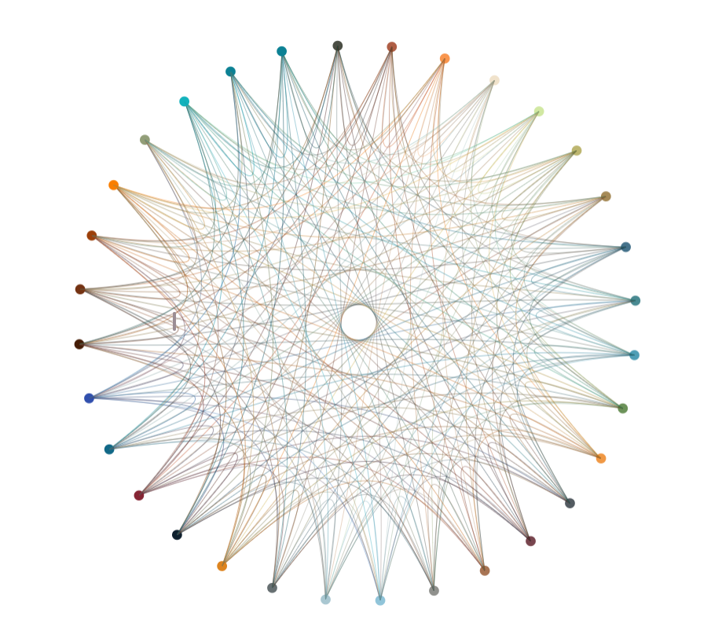

# Strange Networks

<p align="center">
  
  <br>
  <em>Figure 1. Depiction of the Strange Networks website animation showing nodes with notes and connections.</em>
</p>

Strange Networks is a generative network visualization built with [p5.js](https://p5js.org/). It arranges thirty-two nodes across five spatial configurations and connects them with animated Catmull-Rom curves whose colors blend between each pair of endpoints. The result is something between a data diagram and an organism — a structure that feels like it is mapping something, without making any claims about what.

The sketch was originally made for the [#WCCChallenge](https://openprocessing.org/), themed around "mapping."

---

## What It Does

On load, thirty-two nodes appear arranged in a circle and begin slowly orbiting their positions. Each node has a type, either 0 or 1, and connections are drawn only between nodes of different types. This makes the graph bipartite by construction — every visible edge crosses a type boundary, and nodes of the same type never connect to one another.

Clicking anywhere cycles through five layout modes. Each one repositions the nodes differently and reconfigures how the connecting curves are drawn. Mouse wheel zooms in and out. Pressing space toggles the orbital motion on and off.

The five modes move through a circular arrangement, a radial split where node type determines orbit radius, a two-column linear layout, a diagonal scatter, and a seeded random spread. Each mode uses a different curve control point strategy, which is what gives each configuration its own visual character.

---

## The Edges

The curves are drawn using p5's `curve()` function, which implements Catmull-Rom splines. Unlike Bezier curves, Catmull-Rom splines pass through their control points — but in p5, the first and last arguments to `curve()` are phantom control points that shape the tension of the curve without being drawn themselves. This is what creates the sweeping, arched edges rather than straight lines.

In each mode, the phantom control points are calculated differently. In the circular mode they are pulled far outward from the canvas center, giving the edges a gentle outward bow. In the two-column mode they are offset horizontally with an exaggerated vertical pull, creating near-right-angle bends. These are not stylistic tweaks applied after the fact — the geometry of the control points is the layout logic.

Each edge color is computed with `lerpColor()` at a midpoint of 0.5 between the two node colors. The palette itself contains thirty-two hex values with alpha, which means the edge colors are always unique pairings from that set. As nodes move, their edge colors travel with them. The network is never static in hue.

---

## Motion and Frequency

Each node carries a counter that increments over time when the sketch is in motion. This counter feeds into `cos()` and `sin()` expressions that offset the node's target position, producing a small continuous orbit around the layout anchor.

A `freq` variable multiplies this counter before it enters the trigonometric functions. At low values the orbits are slow and wide. As `freq` increases, the motion becomes tighter and more agitated. Cycling through all five modes increments `freq` at the wraparound point, so the character of the motion shifts as you explore the layouts. The frequency display sits in the bottom-right corner as a live readout.

Position updates use `lerp()` at a factor of 0.1 each frame, which means nodes ease toward their targets rather than jumping. This makes mode transitions feel like the network is physically relocating — nodes trail behind the layout change and settle into place over roughly half a second.

---

## Tweaking It

The palette array at the top of `sketch.js` is the most direct way to change the feel of the piece. The current set is earthy and muted, with transparencies baked into the hex values via an alpha channel suffix. Swapping in a high-contrast or monochromatic palette changes the edge color blending entirely. A palette of near-identical hues would make the edge gradients almost invisible. A palette of complementary pairs would make every edge a chromatic event.

The lerp factor of 0.1 in `show()` controls how quickly nodes follow their targets. Dropping it to 0.02 makes the network feel viscous and slow to respond. Raising it closer to 1 makes transitions nearly instantaneous and removes most of the animation. The difference reads very differently across layout modes — the diagonal scatter especially changes character depending on how long nodes take to arrive.

The phantom control point multipliers in `connect()` are also worth experimenting with. The `1.5 * width` and `2 * width` values in modes 0 and 1 determine how far outside the canvas the Catmull-Rom tension anchors are placed. Pulling these closer flattens the curves. Pushing them further out tightens the bow. In mode 2, the vertical multiplier `5 * (this.pos.y - other.pos.y)` exaggerates the vertical tension proportional to the distance between nodes — changing that multiplier to 2 or 10 produces markedly different topologies from the same layout.

The commented-out `resetNodes()` call in `mousePressed()` is also worth enabling. With it active, nodes respawn at the origin on every mode change and lerp outward to their new positions from scratch, which makes transitions read as a full regeneration rather than a rearrangement.

---

## Run It Locally

No build tools or dependencies are required beyond a browser. Clone the repository, open `index.html` in any modern browser, and the sketch runs immediately via the p5.js CDN.

```bash
git clone https://github.com/ionas/Strange-Networks.git
```